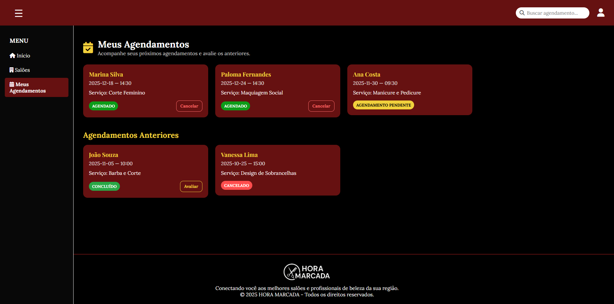
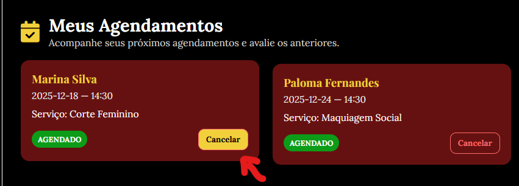
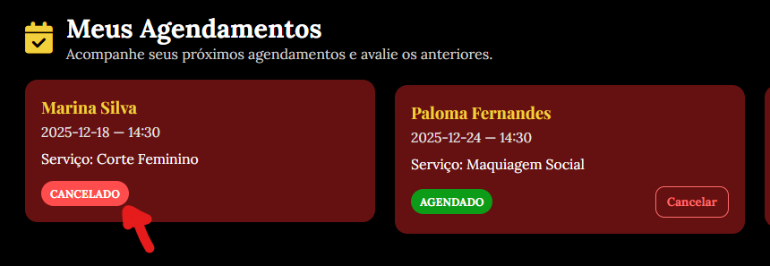

## 🗓️ Tela – Meus Agendamentos

Exibe todos os agendamentos do usuário em cards, separados entre futuros e anteriores.
Permite buscar agendamentos, visualizar detalhes e realizar ações como cancelar ou avaliar.
As cores indicam o status de cada agendamento, tornando a navegação simples e intuitiva.

Link da pagina: https://giselerdsantos.github.io/Sprint-2/

TELA AGENDAMENTOS DO USUÁRIO:

OPÇÃO DE CANCELAR AGENDAMENTO:

